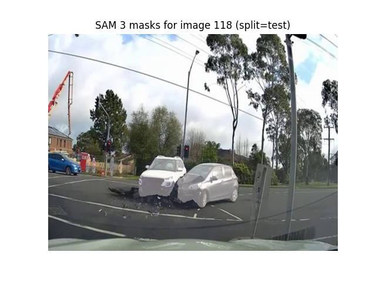

# DVARF: Drone Vehicle Accident Recognition

Experimental evaluation of Meta's Segment Anything Model 3 (SAM 3) for zero-shot object detection in aerial accident scene imagery.



---

## Overview

This project investigates the application of **SAM 3**, Meta's foundation model for image segmentation, to the domain of accident scene analysis from drone footage. While SAM 3 was designed as a general-purpose segmentation model, this work explores its effectiveness when applied to a specialized detection task using only text-based prompts, without any fine-tuning on the target domain.

The core research question is whether modern vision-language models like SAM 3 can perform reliably in emergency response scenarios where traditional object detectors would require extensive labeled training data. The project addresses this through a systematic experimental pipeline with three main components:

**Zero-shot Detection:** SAM 3 is queried using simple natural language prompts for three object classes relevant to accident scenes: crashed vehicles, persons, and undamaged vehicles. The model outputs segmentation masks which are then converted to bounding box detections in YOLO format, enabling direct comparison with traditional detection methods using standard metrics like mean Average Precision (mAP).

**Segmentation Preservation:** Beyond detection metrics, the project preserves SAM 3's native segmentation outputs as binary masks. This dual-output approach maintains the detailed spatial information that could be valuable for downstream analysis tasks such as damage assessment or scene reconstruction.

**Linear Probing:** To investigate whether SAM 3's performance can be improved with minimal supervision, a lightweight linear classifier is trained on top of the model's outputs. This classifier learns to re-score detections based on simple geometric features (bounding box dimensions, aspect ratios, confidence scores) extracted from the predictions on a small training set. The linear probe provides a low-cost adaptation method that does not require retraining the foundation model itself.

---

## Hardware Requirements

SAM 3 can run on CPU-only systems, but inference is slow, taking approximately 5-10 minutes per image on moderate consumer hardware. The minimum system requirements are 16 GB of RAM and 10 GB of free disk space for storing the model weights. 

For practical experimentation, a GPU is strongly recommended. An NVIDIA GPU with at least 8 GB of VRAM (such as an RTX 3060 or better) provides reasonable inference speeds. The system should have CUDA 11.7 or later installed for GPU acceleration. All experiments reported in this project were conducted on Google Colab using a Tesla T4 GPU, which provides sufficient performance for research purposes at no cost.

---

## Installation

Install dependencies as specified in `requirements.txt`:

```bash
# 1. Install PyTorch (see https://pytorch.org for GPU version)
pip install torch torchvision torchaudio

# 2. Install SAM 3
pip install git+https://github.com/facebookresearch/segment-anything-3.git

# 3. Install project dependencies
pip install -r requirements.txt
```

See `requirements.txt` for detailed installation instructions and platform-specific notes.

---

## Google Colab

For quick experimentation without local setup, two ready-to-use Jupyter notebooks are provided in the `notebooks/` directory. These notebooks run entirely on Google Colab's free GPU instances and handle all installation and data preparation steps automatically.

**Zero-Shot Inference Notebook** ([`test_sam3.ipynb`](notebooks/test_sam3.ipynb)): Demonstrates SAM 3's zero-shot object detection capabilities on the test set. This notebook provides a streamlined workflow for running inference and evaluating results without any training or fine-tuning.

**Linear Probing Notebook** ([`test_sam3_linearProbing.ipynb`](notebooks/test_sam3_linearProbing.ipynb)): Contains the complete experimental pipeline including running SAM 3 on the training split to generate predictions and features, building the linear probe dataset, training the classifier, and evaluating the enhanced predictions on the test set.

To use these notebooks, upload them to Google Colab, ensure GPU runtime is enabled (Runtime → Change runtime type → T4 GPU), and execute cells sequentially. The notebooks will automatically clone this repository, install dependencies, and guide you through the authentication process for Hugging Face model access.

---

## Dataset Format

The project uses the YOLO annotation format, which organizes data into separate directories for images and labels, with each split (train, validation, test) stored independently.

Each annotation file is a plain text file with the same base name as its corresponding image. For an image file `123.jpg`, the annotations are stored in `123.txt`. Each line in the annotation file represents one object instance with five space-separated values: `class_id center_x center_y width height`. The class ID is an integer (0, 1, or 2 for this project), while all spatial coordinates are normalized to the range [0, 1] relative to image dimensions.

The three object classes detected in this work are: Class 0 (crashed vehicles), Class 1 (persons at the accident scene), and Class 2 (undamaged vehicles). These classes were chosen to cover the primary elements relevant for accident scene documentation and analysis.

---

## Usage

### Zero-shot Inference

To run SAM 3 inference on a dataset split, execute the `run_sam3_on_split.py` script. This script processes each image by querying SAM 3 once per class using the corresponding text prompt, then applies class-wise Non-Maximum Suppression (NMS) to reduce duplicate detections. The script generates two types of output: YOLO-format bounding box predictions saved as text files in `data/processed/predictions/sam3_yolo/{split}/`, and binary segmentation masks saved as PNG images in `data/processed/segmentations/sam3/{split}/`.

```bash
python scripts/run_sam3_on_split.py
```

Configuration parameters such as confidence threshold, NMS IoU threshold, and whether to save segmentations can be adjusted by editing variables at the top of the script.

### Evaluation

The evaluation script computes standard object detection metrics by comparing predictions against ground-truth annotations. Metrics include per-class and overall Precision, Recall, F1 score, AP@0.50, and AP@0.50:0.95. Results are printed to the console and can be redirected to a file for record-keeping.

```bash
python scripts/eval_sam3_on_split.py > results/sam3_test_metrics.txt
```

### Linear Probing

The linear probing pipeline consists of four sequential steps. First, features are extracted from SAM 3's predictions on the training set, creating a dataset where each detection is represented by a feature vector containing its confidence score and geometric properties. Second, a per-class logistic regression model is trained to predict whether each detection is a true positive or false positive based on these features. Third, the trained weights are applied to re-score all predictions on the test set. Finally, the re-scored predictions are evaluated using the same metrics as the zero-shot experiment.

```bash
# Build feature dataset from training predictions
python scripts/build_linear_probe_dataset.py

# Train logistic regression classifiers
python scripts/train_linear_probe.py

# Apply learned weights to test predictions
python scripts/apply_linear_probe_to_split.py

# Evaluate performance with linear probe
python scripts/eval_sam3_linear_probe_on_split.py
```

### Visualization

Two visualization scripts are provided for qualitative analysis. The first displays segmentation masks overlaid on the original images with class-specific colors, allowing visual inspection of SAM 3's segmentation quality. The second provides a side-by-side comparison of ground-truth bounding boxes and predicted boxes, making it easy to identify false positives, false negatives, and localization errors.

```bash
# View segmentation masks overlaid on images
python scripts/show_sam3_masks_on_image.py

# Compare ground truth annotations vs predictions
python scripts/show_gt_vs_sam3.py
```

---

## Metrics Methodology

### Class-Specific Average IoU

The **mean IoU** metric measures the average Intersection over Union for correctly matched predictions:

1. **Matching Algorithm**: For each ground truth box, we find the predicted box with the highest IoU. A prediction is considered a **True Positive (TP)** if:
   - The predicted class matches the ground truth class
   - The IoU is ≥ 0.5
   - The ground truth has not already been matched to another prediction

2. **Per-Class IoU**: For each of the three classes (crashed car, person, undamaged car), we calculate the mean IoU over all True Positives for that class. If a class has zero True Positives, its IoU medio is 0.0.

3. **Overall Mean IoU**: The arithmetic mean of the three per-class IoU values. This provides a single metric that reflects both localization quality and class-specific performance.

This metric is calculated on the **test set** and complements the standard AP@0.50 metric by directly measuring localization quality for correct detections.

### Inference Speed

The **speed per frame** metric measures the average time required to process a single image:

**Components Included**:
- Image loading from disk (I/O)
- SAM 3 model inference (forward pass for each class prompt)
- Post-processing (YOLO format conversion, NMS)
- Linear probe application (for the linear probing variant only)

**Measurement Procedure**:
1. Load all test set image paths
2. Synchronize GPU (if available)
3. Start timer
4. Process each image through the complete pipeline
5. Synchronize GPU (if available)
6. End timer and divide by number of images

**Note**: The timing includes I/O because SAM 3's `predict_with_text()` method loads images internally from file paths. The reported speed represents the complete end-to-end pipeline as it would be deployed in practice.

Speed is measured separately for:
- **SAM 3 zero-shot**: Model inference + post-processing
- **SAM 3 + linear probe**: Model inference + linear classifier + post-processing

Both metrics are measured on the **test set** and saved to the metrics files alongside precision, recall, F1, and AP scores.

---

## Experimental Results

Results on test split (confidence threshold = 0.26):

### Zero-shot SAM 3

| Class | Precision | Recall | F1 | AP@0.50 | AP@0.50:0.95 |
|-------|-----------|--------|-----|---------|--------------|
| Crashed car | 0.490 | 0.674 | 0.568 | 0.512 | 0.235 |
| Person | 0.700 | 0.656 | 0.677 | 0.603 | 0.195 |
| Undamaged car | 0.380 | 0.074 | 0.124 | 0.061 | 0.042 |
| **Overall** | **0.493** | **0.348** | **0.408** | **0.392** | **0.157** |

### SAM 3 + Linear Probe

| Class | Precision | Recall | F1 | AP@0.50 | AP@0.50:0.95 |
|-------|-----------|--------|-----|---------|--------------|
| Crashed car | 0.490 | 0.674 | 0.568 | 0.520 | 0.248 |
| Person | 0.700 | 0.656 | 0.677 | 0.597 | 0.166 |
| Undamaged car | 0.439 | 0.070 | 0.121 | 0.065 | 0.034 |
| **Overall** | **0.503** | **0.345** | **0.410** | **0.394** | **0.149** |

---

## Model Comparison

Comprehensive comparison of SAM 3 with other zero-shot and supervised models on the test set. Metrics include class-specific mean IoU for zero-shot models and AP@0.5 scores for detection models:

| Model | Type/Phase | IoU medio crashed car | IoU medio person | IoU medio car | mIoU | Speed (ms/frame) | AP@0.5 crashed | AP@0.5 person | AP@0.5 car | mAP@0.5 |
|-------|------------|----------------------|------------------|---------------|------|------------------|----------------|---------------|------------|---------|
| **Moondream 2** | ZSOD | 0.42 | 0.47 | 0.43 | 0.44 | ~1000 | N/A | N/A | N/A | N/A |
| **OMDET TURBO** | ZSOD | 0.65 | 0.77 | 0.74 | 0.72 | ~2000 | N/A | N/A | N/A | N/A |
| **YOLOe** | ZSOD | 0.46 | 0.61 | 0.52 | 0.53 | ~20 | N/A | N/A | N/A | N/A |
| **YOLOe base** | Pre fine-tuning | N/A | N/A | N/A | N/A | ~20 | 0.547 | 0.458 | 0.294 | 0.433 |
| **YOLOe specialized** | Post fine-tuning | N/A | N/A | N/A | N/A | ~20 | 0.911 | 0.760 | 0.803 | 0.825 |
| **SAM 3** | Zero-shot | 0.742 | 0.671 | 0.757 | 0.723 | 6146 | 0.512 | 0.603 | 0.061 | 0.392 |
| **SAM 3 + LP** | Linear Probe | 0.742 | 0.671 | 0.758 | 0.724 | 5862 | 0.520 | 0.597 | 0.065 | 0.394 |

**Notes**:
- **IoU medio**: Mean Intersection over Union for True Positives (IoU ≥ 0.5) on test set. Higher is better for localization quality.
- **mIoU**: Arithmetic mean of the three class-specific IoU values. For zero-shot prompt-based models (Moondream 2, OMDET TURBO, YOLOe ZSOD), IoU values are reported per text prompt as in the original thesis. For SAM 3, IoU values are computed per detection class on the YOLO-style dataset.
- **Speed**: Average inference time per image including I/O, model forward pass, and post-processing. Measured on test set (100 images for SAM 3). For Moondream 2, OMDET TURBO and YOLOe (ZSOD/base/specialized), speed values are approximate and derived from the thesis (≈1s, ≈2s, ≈20ms per frame).
- **AP@0.5**: Average Precision at IoU threshold 0.5. Standard object detection metric.
- **mAP@0.5**: Mean Average Precision across all classes.
- **ZSOD**: Zero-Shot Object Detection (no training on target domain).
- **N/A**: Metric not applicable or not available for this model/configuration.

**Key Observations**:
- **SAM 3** achieves the highest **localization quality** (mIoU = 0.723) among zero-shot models, significantly outperforming Moondream 2 (0.44) and YOLOe ZSOD (0.53), and **being comparable to OMDET TURBO (0.72), with a slightly higher mIoU**.
- **Fine-tuned YOLOe** achieves the best detection performance (mAP@0.5 = 0.825) but requires domain-specific training.
- **SAM 3's inference speed** (≈6s/frame) is slower than YOLOe (20ms) but comparable to other vision-language models like Moondream (1s) and OMDET (2s).
- **Linear probing** provides minimal improvement for SAM 3 (+0.001 mIoU, +0.002 mAP@0.5) while slightly reducing inference time.

---

## License

SAM 3 is licensed under Apache 2.0 by Meta AI.

---

## Acknowledgments

- **Meta AI** for [Segment Anything Model 3](https://github.com/facebookresearch/segment-anything-3)

